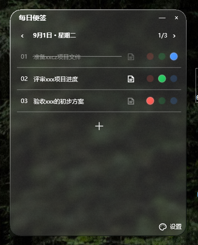

# Visual Reference

The image below is the approved public demonstration reference. All task content is fictional.

## Visual invariants

- A translucent, white-tinted frosted surface that visibly interacts with the desktop background.
- Rounded outer corners with no rectangular blur, glow, or opaque fill outside the curve.
- No rectangular system border when the window loses focus.
- White or user-selected grayscale text with consistent sizing and restrained hierarchy.
- The date is semibold and compact; the header must not consume excessive vertical space.
- Task sequence numbers align consistently on the left.
- Task content and status controls have a clear gap between them.
- Note icons sit immediately before the three status balls.
- Status balls are compact and softly dimensional, without a bright painted highlight spot.
- Only the active status ball is vivid; inactive balls are low-opacity.
- Completed tasks are clearly dimmer, including their note icon, and use a continuous strike-through.
- Task separators remain visible without turning each row into a raised card.
- The plus button is centered below the last task and remains easy to discover.
- Scrollbars appear while scrolling and disappear after inactivity without reserving visible layout space.

## Porting rule

The Windows 10 screenshot defines appearance, spacing, hierarchy, and state styling. A Windows 11 implementation may use different native composition APIs, but the visible result and interaction model should remain substantially the same.

